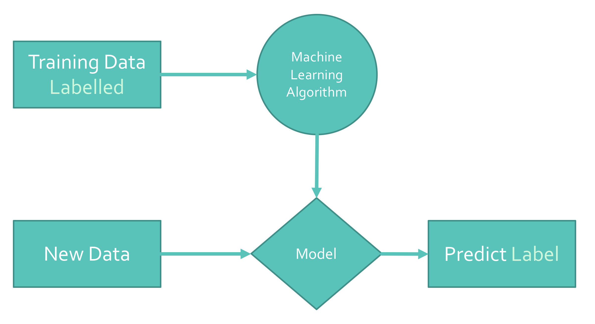

# Automatic tax depreciation rate tagger/classifier

This program uses machine learning to predict the tax depreciation rate when given a text description of an asset/capital expenditure (capex).


# Problem to solve

In the Real Estate Investment Trust (REIT / Property Funds) industry, real estate assets are held for investment purposes to provide income distributions to investors. A feature of REITs for investors are non-taxable cash distributions which are primarily driven by tax deductible/depreciable capex.

Capex can result in various tax outcomes depending on the jurisdiction. In Australia, generally, depending on the nature of the cost can be: (1) immediately deductible, (2) depreciated over its life at [various](https://www.ato.gov.au/law/view/document?LocID=%22TXR%2FTR20184%2FNAT%2FATO%2FatTABLEB%22&PiT=99991231235958#TABLEB) depreciation rates, (3) be eligible for a building allowance deduction, (4) added to the cost base of the asset to reduce the capital gain upon disposal.

An expert can be engaged to create a tax depreciation schedule (i.e. QS report). This is usually the case for high-value capex e.g. a property acquisition or development project. However, a lot of the day-to-day capex is high-volume and low-value. This does not make it cost effective to outsource to an expert. As such, most businesses are classifying these items manually (or not at all and missing out on tax deductions). 

These manual processes, by nature of being high-volume, are time consuming; and by nature of being low-value, do not result in material errors if an item is misclassified. These attributes make this problem ideal for machine learning to solve.


# How does this program work?

While doing some machine learning exercises, particularly [this one](https://joaorafaelm.github.io/blog/text-classification-with-python), it occurred to me that this problem is essentially a text classification problem. Done manually, a person would read a cost description from a cost report, like "chiller", and then [look it up in the tables](https://www.ato.gov.au/law/view/document?DocID=TXR%2FTR20184%2FNAT%2FATO%2F00023) to find it's either 25 years or 20 years depending on the type.

The machine learning model is built using training data (text descriptions of assets / capex) that has previously been reliably classified (tagged with a depreciation type/rate). Once the model is trained, text descriptions of capex can be fed in, and it will predict the tax attributes.



## Validation

The trained model is tested by predicting results using other data with a known classification. The predicted classification is then matched against the known classification giving an overall correctness %.

Using private training data not included in this repo, a model was developed using 18,899 rows of training data which produced:

- 89.6% accuracy when using a random subset of the training data for training data vs testing data.
- 83.8% accuracy using K-Fold Cross Validation using 10 subsets (more thorough version of above).
- 92.3% accuracy when entirely tested against itself (artificially high).

This repo includes anonymised training data. It is sourced from the Australian Tax Office [effective life tables](https://www.ato.gov.au/law/view/document?DocID=TXR/TR20184/NAT/ATO/00001) (run the `demo.py` included, and follow the instructions to run an accuracy report).

I've found that using capex descriptions of a style which is very different from the training data causes the accuracy to deteriorate rapidly.

## Future applications

The trained model can easily be used programmatically as part of a broader automated system. E.g. text can be fed directly into the model from the accounting ledger descriptions, classified using the model, then generate the accounting system input entries to capitalise to the correct accounts and fixed asset register. 

## Further improvements in the works...

The training dataset has high reliability of having the correct classification, however, the text descriptions are of a single style. By training the model with real world text descriptions (different styles of language) and offering feedback and corrections, the model's accuracy may be improved. 

Another thing to point out is that the model appears to bias towards classifications where there is more training data of that depreciation category. However, this is not necessarily a weakness. If the training data set is reflective of a business's actual depreciation register, the natural distribution of assets/capex purchased would be reflected in the predictions (e.g. not many of us need 1,000s of air conditioners for every 1 chair).

These issues can be seen in the accuracy results when using K-Fold Cross Validation vs testing the data against itself.

I've found that creating new training data (different style, new descriptions) results in higher prediction accuracies. These weaknesses may be overcome by using a testing environemnt where a user can manually flag and correct wrong predictions so the training data can be further refined. 

### Next iteration

My next experiment with this is to generate additional training data by finding synonym combinations for the existing training data. This should overcome some of the text style issues

## Some machine learning details

In order to run machine learning algorithms on text based data like this, we need to transform the text into numerical values. Pre-processing this tex is vital to the accuracy of the model.
 
Bag-of-words is one of the most used models for text. It essentially assigns a numerical value to words, creating a list of numbers.

Converting letters or words into numbers by e.g. counting frequencies of letters might not be enough. For example, long words or descriptions can bias the model because it is focusing on the assigned numerical value which really denotes length and not meaning.

Other problems relate to trying to extract "meaning" from words. Take for example the words ‘carpet’ and ‘carpeting’. They would be considered different words under a strict numerical assignment. This problem can be solved with various methods e.g. we can group together the inflected forms of a word. For example, the words ‘walked’, ‘walks’ and ‘walking’, can be grouped into their base form, the verb ‘walk’. Another issue worth noting is that some words despite the fact that they appear frequently, they do not really make any difference for classification because they don't change the meaning, and could even help mis-classify a text description. Words like ‘a’, ‘an’, ‘the’, ‘to’, ‘or’ etc, are known as stop-words. These words can be ignored during the machine learning process.

These issues and others are dealt with during the training of the model.


# Usage

The primary code is in `text_classifier_deprn_rates.py`. Once the `DeprnPredictor` Class has been instantiatied, call the `predict_description(user_description)` method by feeding it some text to classify. Use a loop and call this over and over again.


See `demo.py` for an example of usage of this. Sample interaction below:

```
Evaluate using user input.
"QQ" to quit.
"CR" to see classification report.
Otherwise...
Enter a depreciable asset description: 
landscaping
Input from user:
	 landscaping
Result:
	account: 			CGT_Cost_Base_0
	deprn rate: 		0.0% prime cost
	effective life: 	0 years effective life
	tax category: 		CGT_Cost_Base
END of Result

Enter a depreciable asset description: 
demolition
Input from user:
	 demolition
Result:
	account: 			CGT_Cost_Base_0
	deprn rate: 		0.0% prime cost
	effective life: 	0 years effective life
	tax category: 		CGT_Cost_Base
END of Result

Enter a depreciable asset description: 
alarms
Input from user:
	 alarms
Result:
	account: 			Div40_Plant_6
	deprn rate: 		16.6% prime cost
	effective life: 	6 years effective life
	tax category: 		Div40_Plant
END of Result

Enter a depreciable asset description: 
fence
Input from user:
	 fence
Result:
	account: 			Div40_Plant_20
	deprn rate: 		5.0% prime cost
	effective life: 	20 years effective life
	tax category: 		Div40_Plant
END of Result

Enter a depreciable asset description: 
chiller
Input from user:
	 chiller
Result:
	account: 			Div40_Plant_25
	deprn rate: 		4.0% prime cost
	effective life: 	25 years effective life
	tax category: 		Div40_Plant
END of Result

Enter a depreciable asset description: 
project to install chillers
Input from user:
	 project to install chillers
Result:
	account: 			Div40_Plant_25
	deprn rate: 		4.0% prime cost
	effective life: 	25 years effective life
	tax category: 		Div40_Plant
END of Result
```


## Training data

Included in the repo is sample training data based on the Australian Tax Office [effective life tables](https://www.ato.gov.au/law/view/document?DocID=TXR/TR20184/NAT/ATO/00001). 

I would note from experience that the accuracy of the predictions is highly dependent on good training data. This sample data creates decent results if the language used is very similar to it.

The best data to use would be actual descriptions and assets from a REIT's fixed asset/depreciation register. Unfortunately, this data is proprietary to organisations unless donated to this repo.

However, I have some [ideas](#next-iteration) to generate some data.


# Installation

#### 1. Python 3.6+

[Download](https://www.python.org).

#### 2. Download all data that NLTK uses

[NLTK](https://www.nltk.org) is a key component of pre-processing the text data.

```bash
python -m nltk.downloader all;
```

#### 3. Python libraries

This program relies on the [`pandas`](http://pandas.pydata.org) and [`scikit-learn`](https://scikit-learn.org/) libraries.

Feel free to install the dependencies yourself. Probably easiest to install [Anaconda](https://www.anaconda.com) as it comes with everything.

